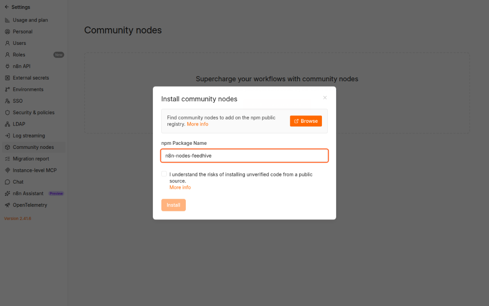

# FeedHive for n8n

Use the [FeedHive Public REST API](https://docs.feedhive.com/rest-api/introduction) in n8n to manage posts, labels, media, plan slots, and social accounts, and retrieve analytics.

## Installation

On a self-hosted n8n instance, sign in as an **Owner or Admin**:

1. Open **Settings → Community Nodes** and select **Install**.
2. Enter `n8n-nodes-feedhive` as the npm package name.
3. Review and accept n8n's community-node risk notice, then select **Install**.
4. In a workflow, add **FeedHive**, then select or create a **FeedHive API** credential.



For details, see n8n's [GUI installation guide](https://docs.n8n.io/integrations/community-nodes/installation-and-management/gui-installation/). Queue-mode deployments follow n8n's [manual installation guide](https://docs.n8n.io/integrations/community-nodes/installation-and-management/manual-installation/) instead.

Create a FeedHive API key under **Settings → Account** or **Settings → Workspace**. Paste it into the **FeedHive API** credential in n8n. **Check Credentials** calls `GET /status`. The credential sends the key only to `https://api.feedhive.com` as a bearer token.

## Operations

| Resource | Operations |
| --- | --- |
| Account | Check Credentials |
| Post | Get Many, Get, Create, Update, Delete |
| Label | Get Many, Get, Create, Update, Delete |
| Media | Start Upload, Complete Upload, Get Many, Get, Delete |
| Plan Slot | Get Many, Get, Create, Update, Delete |
| Plan Assignment | Assign Next |
| Social Account | Get Many, Get |
| Analytics | Get Post Analytics, Get Social Analytics |

**Create Post** defaults to a draft. Scheduling a post or using **Assign Next** may publish it later. Deletions are irreversible.

List operations return a page with `data.items`, `data.has_more`, and `data.next_cursor`. Enter `next_cursor` in **Cursor** to fetch the next page. Page limits range from 1 to 100. The node does not automatically paginate or retry writes. FeedHive limits API requests to 60 per minute; HTTP 429 errors surface in the workflow.

**Start Upload** returns a signed URL. Use a separate n8n **HTTP Request** node to `PUT` the raw file bytes to the returned signed URL within 10 minutes, with the same `Content-Type` declared at upload start. Do not attach a FeedHive credential or send your API key to that URL. Then call **Complete Upload** with the upload session ID (no request body).

The API does not provide documented safe webhook registration and removal, so this package has no trigger. It does not offer a separate immediate-publish action. Analytics freshness depends on the social provider.

## Development

Use Node.js 22 or later:

```sh
npm ci
npm run lint
npm test
npm run dev
```

`npm test` builds the TypeScript package and runs the contract tests. `npm run dev` starts a local n8n editor with the node available. The credential-free templates in `examples/operation-workflows.json` can be adapted with your own credentials and IDs.

Licensed under [MIT](LICENSE).
